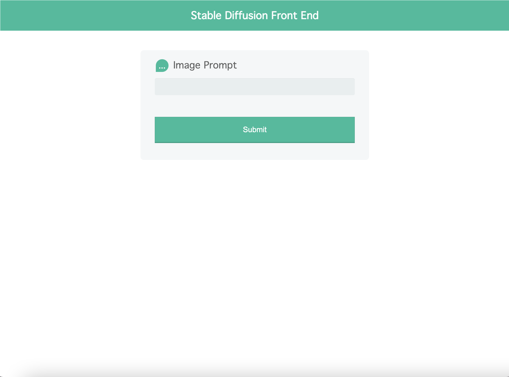
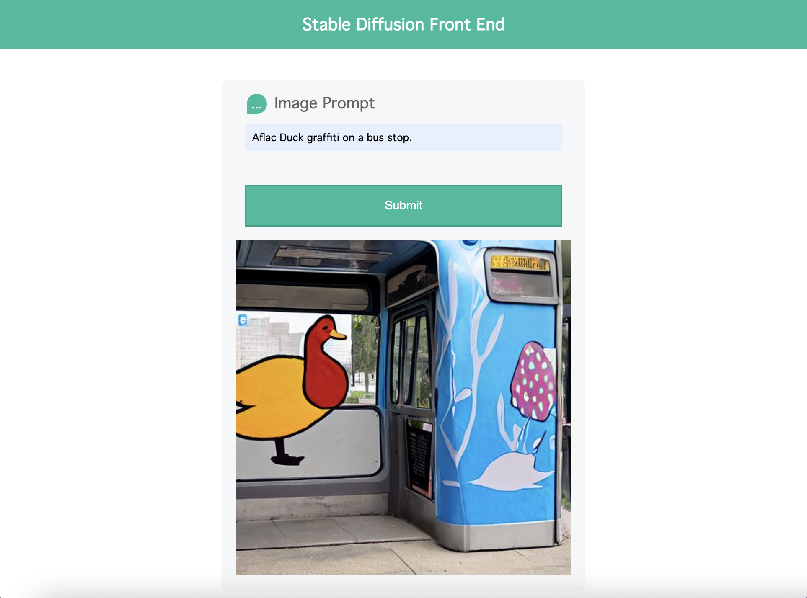

# Stable Diffusion on M1/M2 with Flask Serving

Based on the 🤗 [Diffusers](https://github.com/huggingface/diffusers) GitHub and uses the StableDiffusionPipeline with the [CompVis](https://github.com/CompVis/stable-diffusion) pre-trained model.

To implement on Apple Silicon this [guide](https://huggingface.co/docs/diffusers/optimization/mps) from Huggingface was also used. 

**Running the application took ~6 minutes to generate a single image on Apple Silicon.** 

## Running the Application 

1. Installs 

```
pip install -r requirements.txt
pip install --pre torch torchvision torchaudio --extra-index-url https://download.pytorch.org/whl/nightly/cpu' 
```

2. Code Changes 

- Within *stable_diffusion_setup.py*:
    - The access token for HuggingFace Hub must be provided. 
    - The device type needs set, the default is 'mps' but 'cuda' is also available for non apple silicon runs.

- Within *app.py*:
    - The concept string needs set to the desired concept. 

3. Running Application 

- Running Flask app can be done two ways: 

```
FLASK_APP=app.py
flask run       # or 
flask run -h 0.0.0.0 -p 8000     # use this version for NGROK tunnelling 
```

**or**

`python app.py`

### This will spin up the following webpage application
 


## Some Running Notes 

1. MPS cannot run the *torch_dtype* this needs to be left out of any tokenizer, encoder or pipeline implementation. 
2. The function `pipe.enable_attention_slicing()` reduced the run time by over half using MPS. 
3. This implementation takes in a concept string, these can be found [here](https://huggingface.co/sd-concepts-library).
4. The inital run will take time as the pre-trained models and pipelines will be downloading. 
5. Running the Flask application on port 5000 on Mac with latest OS may cause a conflict when using NGROK to tunnel. 

